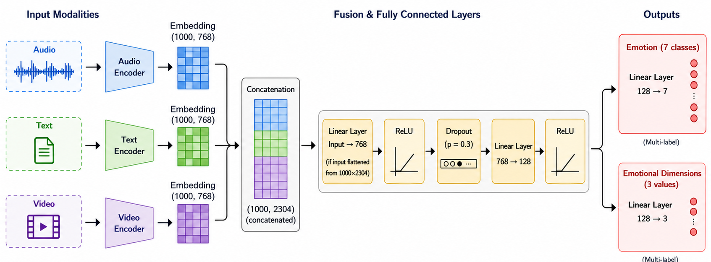

# Multimodal Neurodiverse NLP Dataset for Emotion Recognition

Our goal is to make a novel neurodiverse dataset featuring neurodivergent and neurotypical individuals that can be used to train AI models to recognize emotion and sentiment across neurodiverse populations. 

This depository contains:
- link to a multimodal neurodiverse dataset
- preprocessing pipelines
- pretrained and fine-tuned models and transformers
- a multimodal fusion model designed for affective computing research

The publically available dataset featuring video clips can be found at: https://huggingface.co/datasets/multimodalemotionnlp/Neurodiverse_Multimodal_Dataset

## Installation
1. Clone the repository
```python
git clone <repository-url>
cd Multimodal_NLP
```

2. Create a virtual environment
```
python -m venv venv
source venv/bin/activate  # On Windows: venv/Scripts/activate
```

3. Install necessary dependencies (as seen in the requirements.txt file)
```
pip install -r requirements.txt
```
Note: Make sure all folders and files are saved to the save directory.


## Usage
There are four options to choose from for running a program. 

### 1) Audio Processing (Audio_Processing.py)
> Filtered audio clips can be found at:
https://huggingface.co/datasets/multimodalemotionnlp/cleanedAudioFiles

### 2) Textual Processing (Text_Processing.py)
> Text Preprocessing file can be found in this GitHub repository (Miscellaneous/Text_Preprocessing.txt)

### 3) Visual Processing (Video_Processing.py)
> HDF5 Files can be found at: 
https://huggingface.co/datasets/multimodalemotionnlp/ResearchProjectHDF5Files

### 4) Multimodal Fusion (Multimodal.py)
> If you plan to run Multimodal.py, make sure to run all three modalities (Audio, Text and Video) first. Then make sure to run the embeddings files (found in this GitHub repository at Embeddings/Embeddings Programs) to store the embeddings from each modality before finally running Multimodal.py. 
<br>

_________________________________________________________________________________________________________________________________________

There are two ways of running a program:<br>
1. Running through the command terminal<br>
In the command terminal, navigate to the directory that the program exists in. Example (if running Multimodal.py and performing the emotional dimensions classification task and your path_to_folder is path/to/folder/):

```
python Multimodal.py --emotions_task False --path_to_folder path/to/folder/

--emotions_task:  True  - Emotion Classification Task
                  False - Emotional Dimension Classification Task

--path_to_folder: working directory where the program is saved
```

2. Running using a Python application (ie. Pycharm, etc.).<br>
If running using an application, make sure to comment out the main guard before running the program and change the path_to_folder global variable near the top of the program to your working directory in which the program is saved in and the emotions_task global variable to True if performing the Emotion Classification Task or False if performing the Emotional Dimension Classification Task.

Models used for this research project can be found at:
https://huggingface.co/multimodalemotionnlp/Neurodiverse_NLP_Models

Label Files can be found in this GitHub repository: 
- For the emotional classification task: Labels_File/New_Labels_By_Classification_Emotions_Threshold15.npy
- For the emotional dimensions classification task: Labels_File/Revised_New_Labels_By_Classification_Attributes.npy

## Details Regarding the Dataset
### Data Collection
Video clips were collected from publically-available sources such as YouTube and TikTok.

### Data Annotation
Video clips were annotated using crowd-sourced rating. Raters were assigned to rate clips using a web-interface application, where emotions (anger, disgust, fear, happiness, sadness, surprise and neutral) were rated using sliding scales from 0 to 100 while emotional dimensions (valence, arousal and dominance) were rated using sliding scales ranging from -3 to 3. 

### Data Processing
The multilabel classification approach was utilized as it was better suited for mitigating subjectivity. Emotions were considered as present if the average corresponding rating was over 15. Emotional dimensions were considered as positive if the average corresponding rating was over 1. 

## Model Architectures
1) Wav2Vec2: self-supervised model that operates on raw waveforms and captures localized acoustic patterns and contextualized high-level speech representations
2) BERT Model: encoder-only transformer that is trained using unsupervised learning; picks up contextual representations based on surrounding content
3) Video Vision Transformer (ViViT): utilizes spatial and temporal information to analyze video data
4) Multimodal Fusion: combines information from all three modalities (audio, textual and visual) to produce a single set of predictions<br><br>
Multimodal Fusion Pipeline: <br><br>


## Citation
If using this repository, here is the citation:
```
NEURODIVERSE_MULTIMODAL_NLP_DATASET
```

## License
This repository is licensed under the Apache License, Version 2.0<br>
http://www.apache.org/licenses/LICENSE-2.0 


